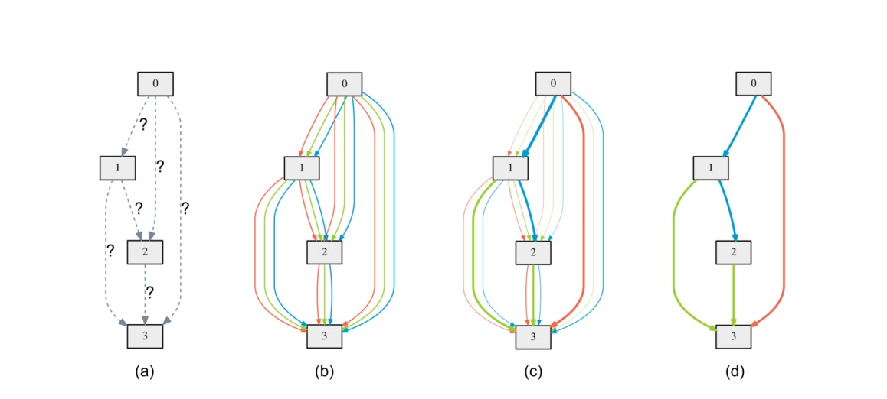
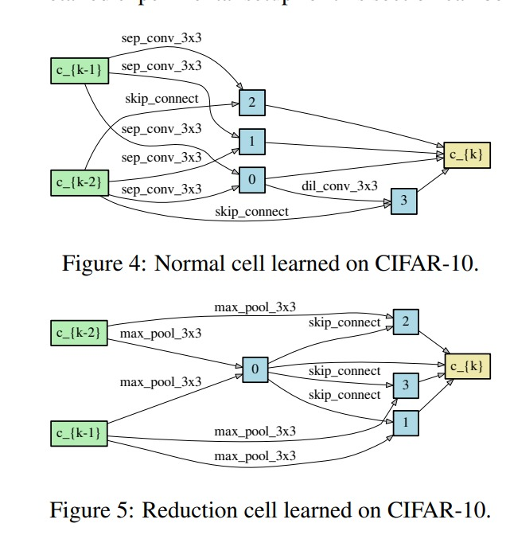

# DARTS: Differentiable Architecture Search — PyTorch Implementation

A clean, cell-by-cell Jupyter notebook implementation of [DARTS: Differentiable Architecture Search](https://arxiv.org/abs/1806.09055) (Liu et al., ICLR 2019), built from scratch without relying on the original codebase.

---

## Table of Contents

1. [What This Is](#what-this-is)
2. [The Problem DARTS Solves](#the-problem-darts-solves)
3. [The Search Space](#the-search-space)
4. [Continuous Relaxation — Making Discrete Choice Differentiable](#continuous-relaxation)
5. [Bilevel Optimization](#bilevel-optimization)
6. [First Order vs Second Order Approximation](#first-order-vs-second-order)
7. [The Cell DAG](#the-cell-dag)
8. [Normal vs Reduction Cells](#normal-vs-reduction-cells)
9. [The Search Network](#the-search-network)
10. [Architecture Derivation — From Soft to Discrete](#architecture-derivation)
11. [The Evaluation Network](#the-evaluation-network)
12. [Auxiliary Head](#auxiliary-head)
13. [Regularization Techniques](#regularization-techniques)
14. [Results](#results)
15. [Notebook Structure](#notebook-structure)
16. [Key Implementation Bugs](#key-implementation-bugs)
17. [Usage](#usage)
18. [Modular Structure](#modular-structure)
19. [Reference](#reference)

---

## What This Is
[Neural Architecture Search ! ](assets/NAS.png)

DARTS replaces the discrete, non-differentiable problem of neural architecture search with a continuous relaxation — placing a softmax-weighted mixture of all candidate operations on each edge of a cell DAG, then optimizing architecture parameters α alongside network weights via bilevel optimization. At the end of search, the soft mixture is discretized by taking the argmax per edge.

This implementation covers the full convolutional search pipeline on CIFAR-10:

- Primitive operations (SepConv, DilConv, FactorizedReduce, etc.)
- MixedOp — the core soft mixture abstraction
- Cell — a DAG of 6 nodes with 14 MixedOp edges
- Search Network — 8-cell stack with shared α parameters
- Architect (first order and second order) — bilevel optimizer
- Architecture derivation — genotype extraction from learned α
- Evaluation Network — 20-cell discrete network from genotype
- Full evaluation training with cutout, path dropout, auxiliary tower

---

## The Problem DARTS Solves

Traditional neural architecture search (NAS) treats architecture design as a black-box optimization problem. You pick an architecture, train it, evaluate it, pick another, and repeat. The best methods before DARTS required:

- **NASNet** (Zoph et al. 2018) — 2000 GPU days of reinforcement learning
- **AmoebaNet** (Real et al. 2018) — 3150 GPU days of evolutionary search

The fundamental bottleneck is that the choice of which operation to place on which edge is a **discrete, non-differentiable decision**. You cannot compute gradients through "which operation did I pick," so you cannot use gradient descent to guide the search. Instead you must sample architectures, evaluate them, and search blindly.

DARTS attacks this directly: instead of making a discrete choice, maintain a **continuous distribution** over operations, and optimize that distribution end-to-end using gradient descent on validation loss.

---

## The Search Space

The search space defines what can be discovered. DARTS searches over **cell topology** — which operations connect which nodes inside a repeating cell building block.

### Candidate Operations (8 total)

| Operation | Description |
|---|---|
| `sep_conv_3x3` | Depthwise-separable convolution, 3×3 kernel, applied twice |
| `sep_conv_5x5` | Depthwise-separable convolution, 5×5 kernel, applied twice |
| `dil_conv_3x3` | Dilated depthwise-separable convolution, 3×3 kernel, dilation=2 |
| `dil_conv_5x5` | Dilated depthwise-separable convolution, 5×5 kernel, dilation=2 |
| `max_pool_3x3` | 3×3 max pooling + BN |
| `avg_pool_3x3` | 3×3 average pooling + BN |
| `skip_connect` | Identity (stride=1) or FactorizedReduce (stride=2) |
| `none` | Zero operation — no connection |

### Separable Convolution

A separable convolution splits a standard conv into two cheaper steps. First a depthwise conv (one filter per channel, captures spatial patterns) followed by a pointwise 1×1 conv (mixes channels). Applied **twice** in sequence in DARTS, following NASNet convention:

```
ReLU → depthwise(C, C, k, groups=C) → pointwise(C, C, 1×1) → BN
     → ReLU → depthwise(C, C, k, groups=C) → pointwise(C, C, 1×1) → BN
```

Stride is only applied in the first application. The second always uses stride=1.

### Dilated Convolution

A dilated conv inserts gaps between kernel elements, expanding the receptive field without increasing parameters. A 3×3 kernel with dilation=2 covers a 5×5 area. Applied once (not twice like SepConv):

```
ReLU → depthwise(C, C, k, dilation=d, groups=C) → pointwise(C, C_out, 1×1) → BN
```

Padding must equal `dilation` for 3×3, `2 * dilation` for 5×5 to preserve spatial size.

### FactorizedReduce

Used as the skip connection in reduction cells where spatial dimensions must halve. Instead of a strided conv (which causes checkerboard artifacts), it applies two shifted 1×1 convs and concatenates:

```
relu(x)
  ├── conv(x,          stride=2) → C_out//2 channels  (even pixels)
  └── conv(x[:,:,1:,1:], stride=2) → C_out//2 channels  (odd pixels)
concat along channel dim → C_out channels
BN
```

The pixel shift ensures both convs see complementary spatial locations, covering the full input without artifacts.

### All Operations Use ReLU-Conv-BN Order

Unlike the standard BN-ReLU order in ResNets, DARTS uses ReLU-Conv-BN throughout. This is the NASNet convention and is applied consistently across all primitives.

---

## Continuous Relaxation



*Figure 1 from the paper: (a) operations on edges are initially unknown, 
(b) continuous relaxation places a mixture of all ops on each edge, 
(c) joint optimization sharpens the mixing weights, 
(d) the final discrete architecture is derived from the learned weights.*

### The Discrete Problem

Normally, choosing an operation for edge (i→j) is discrete. You pick `sep_conv_3x3` or `max_pool` or `skip_connect` — one of 8 options. There is no gradient through this choice.

### The Soft Mixture

DARTS replaces the hard choice with a **weighted sum over all operations simultaneously**:

```
ō(i,j)(x) = Σ_{o ∈ O}  [exp(α_o^(i,j)) / Σ_{o'} exp(α_o'^(i,j))]  ·  o(x)
```

For edge (i→j), instead of running one operation, you run all 8 and take a softmax-weighted sum of their outputs. The weights come from a learnable vector α of dimension 8 — one scalar per operation.

In code this is the `MixedOp`:

```python
class MixedOp(nn.Module):
    def __init__(self, C, stride):
        super().__init__()
        self.ops = nn.ModuleList([
            OPS[name](C, stride, affine=False) for name in OPS
        ])

    def forward(self, x, weights):
        # weights = softmax(alpha[this_edge]), shape (8,)
        return sum(w * op(x) for w, op in zip(weights, self.ops))
```

### Why This Works

The output of MixedOp is a differentiable function of α because:
1. Softmax is smooth and differentiable everywhere
2. Each operation o(x) is differentiable (convs, pooling)
3. The weighted sum is linear in the weights

So `∂L/∂α` exists and can be computed by backprop. Gradient descent can now tell you which operations help and which hurt.

### Why inplace=False Matters

All ReLUs inside MixedOp must use `inplace=False`. During the forward pass, the same input tensor `x` is passed to all 8 operations simultaneously. If any op modifies `x` in-place, it corrupts the input for all subsequent ops. This is a non-obvious bug that produces misleading gradient errors.

---

## Bilevel Optimization

### Two Sets of Parameters

DARTS has two completely separate sets of learnable parameters:

- **`w`** — the weights inside all conv filters, BN layers etc. inside every operation in every MixedOp. These are what a normal network trains.
- **`α`** — the architecture parameters. One vector of 8 scalars per edge. Shape `(14, 8)` for both normal and reduction cells.

### Why Not Optimize Both on Training Data?

The naive approach — optimize w and α jointly on training loss — fails badly. The paper shows this leads to 4.16% test error, worse than random search. The reason: α would overfit to the training set, finding operations that memorize training examples rather than generalizing. α is essentially a hyperparameter and should be chosen based on held-out performance.

### The Bilevel Formulation

The correct objective is:

```
min_α   L_val( w*(α), α )

s.t.    w*(α) = argmin_w  L_train( w, α )
```

Find the architecture α that minimizes validation loss, where the weights are **fully optimized for that architecture on training data**. This is a bilevel optimization problem — one problem nested inside another.

### The Alternating Update

Each training iteration does two sequential steps:

**Step 1 — Update α (upper level):**
- Compute validation loss using current weights
- Backprop into α
- Adam step on α

**Step 2 — Update w (lower level):**
- Compute training loss using current α
- Backprop into w
- SGD step on w

The key asymmetry: **α sees validation data, w sees training data**. This separation is the whole point — it prevents α from overfitting to training.

### Parameter Separation in Code

Arch parameters must be explicitly excluded from the weight optimizer:

```python
# Only weight parameters go to SGD
weight_params = [p for p in model.parameters()
                 if p not in set(model.arch_parameters())]
optimizer_w = torch.optim.SGD(weight_params, lr=0.025, momentum=0.9)

# Only arch parameters go to Adam
optimizer_a = torch.optim.Adam(model.arch_parameters(), lr=3e-4)
```

Passing α to SGD would destroy the bilevel structure — α would be updated on training loss instead of validation loss.

---

## First Order vs Second Order

### The Exact Gradient

To compute the gradient of the outer objective `L_val(w*(α), α)` with respect to α exactly, you need `w*(α)` — the fully converged weights for the current architecture. Computing this requires training to convergence every time you want to take one α gradient step. Completely intractable.

### First Order Approximation (ξ = 0)

The simplest approximation: pretend the current weights w are already optimal. Just compute:

```
∇α L_val(w, α)
```

This is just the gradient of validation loss with respect to α using current weights. Fast, one extra forward/backward pass, but slightly less accurate because it ignores how α affects the weight optimization.

### Second Order Approximation (ξ > 0)

A better approximation: take one gradient step on training loss to get "unrolled" weights w', then compute the gradient at w':

```
∇α L_val( w - ξ∇_w L_train(w, α),  α )
```

Expanding by chain rule gives two terms:

```
∇α L_val(w', α)  -  ξ · ∇²_{α,w} L_train(w, α) · ∇_{w'} L_val(w', α)
```

The second term is a mixed second-order derivative — an |α|×|w| matrix-vector product. Computing it exactly is O(|α||w|), intractable for large networks.

### Finite Difference Approximation

The second term is approximated using finite differences. Let v = ∇_{w'} L_val(w', α):

```
ε  = 0.01 / ‖v‖₂
w+ = w + ε · v
w- = w - ε · v

∇²_{α,w} L_train · v  ≈  [∇α L_train(w+) - ∇α L_train(w-)] / 2ε
```

This reduces complexity from O(|α||w|) to O(|α| + |w|), requiring only two extra forward/backward passes through the training set.

### The Full Second Order Step

```python
def step(x_val, y_val, x_train, y_train, xi):
    # 1. compute w' = w - xi * grad_w L_train
    train_loss = cross_entropy(model(x_train), y_train)
    dw = autograd.grad(train_loss, w)
    w_prime = [p - xi*g for p, g in zip(w, dw)]

    # 2. load w' into model, compute val loss
    load_weights(model, w_prime)
    val_loss = cross_entropy(model(x_val), y_val)

    # 3. get gradients at w'
    dw_prime = autograd.grad(val_loss, w, retain_graph=True)
    dalpha   = autograd.grad(val_loss, arch_params)
    restore_weights(model, original)

    # 4. finite difference correction
    eps = 0.01 / norm(dw_prime)
    w_plus  = [p + eps*g for p, g in zip(w, dw_prime)]
    w_minus = [p - eps*g for p, g in zip(w, dw_prime)]

    load_weights(model, w_plus)
    grad_plus = autograd.grad(cross_entropy(model(x_train), y_train), arch_params)
    restore_weights(model, original)

    load_weights(model, w_minus)
    grad_minus = autograd.grad(cross_entropy(model(x_train), y_train), arch_params)
    restore_weights(model, original)

    correction = [(gp - gm) / (2*eps) for gp, gm in zip(grad_plus, grad_minus)]

    # 5. final gradient = dalpha - xi * correction
    final_grad = [da - xi*c for da, c in zip(dalpha, correction)]

    for p, g in zip(arch_params, final_grad):
        p.grad = g
    optimizer_alpha.step()
```

### Performance Comparison

| Method | Search Cost | CIFAR-10 Test Error |
|---|---|---|
| First order (ξ=0) | 1.5 GPU days | 3.00 ± 0.14% |
| Second order (ξ>0) | 4 GPU days | 2.76 ± 0.09% |

---

## The Cell DAG

### Node Structure

Each cell is a directed acyclic graph with 6 nodes:

```
node 0  —  input 1    (output of cell k-2, or stem)
node 1  —  input 2    (output of cell k-1, or stem)
node 2  —  intermediate  (learned)
node 3  —  intermediate  (learned)
node 4  —  intermediate  (learned)
node 5  —  intermediate  (learned)
output  —  concat(node2, node3, node4, node5) along channel dim
```

The `steps=4` parameter refers to the 4 intermediate nodes — not the total.

### Full Connectivity

Every node connects to **all subsequent nodes**, not just the immediate next one. This is not a sequential chain — it is a fully connected DAG in the forward direction:

```
node 0 ──► node 2, node 3, node 4, node 5
node 1 ──► node 2, node 3, node 4, node 5
node 2 ──► node 3, node 4, node 5
node 3 ──► node 4, node 5
node 4 ──► node 5
```

Total edges: 2+3+4+5 = **14 edges**, each with its own MixedOp and its own α vector of dimension 8. So `α_normal` has shape `(14, 8)`.

### Node Computation

Each intermediate node is the **sum** of all its predecessors, each passed through its own MixedOp:

```
node2 = MixedOp(0→2)(node0, weights[0]) + MixedOp(1→2)(node1, weights[1])
node3 = MixedOp(0→3)(node0, weights[2]) + MixedOp(1→3)(node1, weights[3])
       + MixedOp(2→3)(node2, weights[4])
...
```

The forward pass uses an offset counter and a growing states list:

```python
states = [s0, s1]
offset = 0
for i in range(steps):                         # 4 intermediate nodes
    s = sum(
        self.edges[offset+j](states[j], weights[offset+j])
        for j in range(len(states))
    )
    offset += len(states)
    states.append(s)
return torch.cat(states[2:], dim=1)            # skip inputs, concat intermediates
```

### Why Two Input Nodes

Taking outputs from the **two most recent cells** (k-2 and k-1) rather than just one gives each cell access to features at two different levels of abstraction. The search can discover that certain nodes benefit from older, less-processed features (from k-2) or newer features (from k-1). The 1×1 preprocessing convs normalize both inputs to channel dimension C before they enter the DAG.

When a reduction cell appears between k-2 and k-1, they have different spatial sizes. The preprocessing for s0 uses `FactorizedReduce` instead of `ReLUConvBN` to halve the spatial size of the older input and match the newer one.

---

## Normal vs Reduction Cells

### Normal Cell

Preserves spatial dimensions. All MixedOps use stride=1.

```
input:   (B, C_prev_prev, H, W) and (B, C_prev, H, W)
output:  (B, 4*C, H, W)        ← same H, W; 4x channels from concat
```

### Reduction Cell

Halves spatial dimensions. MixedOps on edges connected to **input nodes** (j < 2) use stride=2. All edges between intermediate nodes still use stride=1.

```
input:   (B, C_prev_prev, H, W) and (B, C_prev, H, W)
output:  (B, 4*C, H/2, W/2)   ← halved H, W; 4x channels from concat
```

The stride is only applied at the **entry point** — edges from nodes 0 and 1. This halves spatial resolution in one step at the beginning of the cell.

### Placement in the Network

Reduction cells appear at 1/3 and 2/3 depth:

```python
reduction = (i == total_cells // 3 or i == 2 * total_cells // 3)
```

For 8 cells: positions 2 and 5. For 20 cells: positions 6 and 13.

The network progressively reduces spatial resolution:

```
stem:           32×32
after cell 2:   16×16  (reduction)
after cell 5:   8×8    (reduction)
global pool:    1×1
```

---

## The Search Network

### Architecture

```
RGB image (B, 3, 32, 32)
    ↓
stem: Conv2d(3, C*3, 3, padding=1) + BN
    ↓ (B, C*3, 32, 32)
cell 0  — normal
cell 1  — normal
cell 2  — reduction    ← position total_cells//3
cell 3  — normal
cell 4  — normal
cell 5  — reduction    ← position 2*total_cells//3
cell 6  — normal
cell 7  — normal
    ↓
global average pool → (B, C_final, 1, 1)
flatten → (B, C_final)
linear classifier → (B, 10)
```

### Channel Accounting

Channels grow as cells progress. Starting from `C_init=16`:

```
stem output:    C*3 = 48 channels
cell 0 output:  4*C = 64 channels     (C stays 16)
cell 1 output:  4*C = 64 channels     (C stays 16)
cell 2 output:  4*C = 64 channels     (C stays 16, doubles after)  → C becomes 32
cell 3 output:  4*C = 128 channels    (C=32)
cell 4 output:  4*C = 128 channels    (C stays 32)
cell 5 output:  4*C = 128 channels    (C stays 32, doubles after)  → C becomes 64
cell 6 output:  4*C = 256 channels    (C=64)
cell 7 output:  4*C = 256 channels    (C=64)
```

C_prev and C_prev_prev track the channel counts of the two most recent cell outputs, passed as arguments to each new cell's preprocessing convs.

### Architecture Parameter Sharing

A critical design choice: all normal cells share the **same** `α_normal`, and all reduction cells share the **same** `α_reduce`. This means:

- Total arch parameters: 14×8×2 = **224 scalars**
- Without sharing: 14×8×8 = 896 for search network

Sharing dramatically reduces the search space and stabilizes training. The α tensors are registered as `nn.Parameter` on the Search Network, not on individual cells.

### Forward Pass

```python
def forward(self, x):
    weights_normal = F.softmax(self.alpha_normal, dim=-1)  # (14, 8)
    weights_reduce = F.softmax(self.alpha_reduce, dim=-1)  # (14, 8)

    s0 = s1 = self.stem(x)
    for cell in self.cells:
        weights = weights_reduce if cell.reduction else weights_normal
        s0, s1 = s1, cell(s0, s1, weights)

    out = self.global_pooling(s1)
    out = out.view(out.size(0), -1)
    return self.classifier(out)
```

The sliding window `s0, s1 = s1, cell(...)` advances both inputs each step — s1 becomes the new s0, and the new cell output becomes the new s1.

---

## Architecture Derivation — From Soft to Discrete

### The Discretization Rule

After 50 epochs of search, `α_normal` and `α_reduce` encode which operations are most valuable. To extract a discrete architecture:

For each intermediate node, keep the **top-2 incoming edges** by softmax strength, excluding the `none` operation:

```python
def parse(alpha):
    softmax_alpha = F.softmax(alpha, dim=-1)   # (14, 8)
    gene = []
    offset = 0
    op_names = list(OPS.keys())

    for node in [2, 3, 4, 5]:
        num_edges = node                        # node2 has 2 edges, node3 has 3, etc.
        best_ops = []

        for j in range(num_edges):
            row = softmax_alpha[offset + j]     # (8,) — weights for this edge
            best_idx      = row[1:].argmax().item() + 1   # exclude none (index 0)
            best_strength = row[1:].max().item()
            best_ops.append((best_strength, op_names[best_idx], j))

        best_ops.sort(reverse=True)
        for strength, op_name, source in best_ops[:2]:
            gene.append((op_name, source))

        offset += num_edges
    return gene
```

### The Genotype

The result is a `Genotype` namedtuple:

```python
Genotype = namedtuple('Genotype', ['normal', 'normal_concat', 'reduce', 'reduce_concat'])
```

Each entry `(op_name, source_node)` means: on the edge coming from `source_node` into this intermediate node, use operation `op_name`.

### The Discretization Gap

The discrete architecture is fundamentally different from the soft search network. During search, all 8 ops were active with weighted contributions. After discretization, exactly 2 edges per node are kept, each with exactly 1 operation. The weights from search are discarded entirely — the evaluation network starts from random initialization.

This gap between the continuous search model and the discrete evaluation model is a known weakness of DARTS. Architectures that rank well during soft search don't always rank the same after discretization, which is why the paper runs 4 seeds and picks the best.

---

## The Evaluation Network

### Architecture

Identical structure to the search network but larger and with fixed operations:

```
RGB image (B, 3, 32, 32)
    ↓
stem: Conv2d(3, C*3, 3, padding=1) + BN
    ↓
20 cells (Cell_Eval, using genotype)
    ↓                   ← auxiliary head attaches here (cell 13 of 20)
global average pool
linear classifier → (B, 10)
```

Key differences from search network:

| | Search Network | Evaluation Network |
|---|---|---|
| Cells | 8 | 20 |
| C_init | 16 | 36 |
| Ops per edge | MixedOp (8 ops, soft) | Single fixed op from genotype |
| BN affine | False | True |
| Alpha params | 224 learnable | None |
| Auxiliary head | No | Yes, at 2/3 depth |
| Training | 50 epochs, bilevel | 600 epochs, standard |

### Cell_Eval — Fixed Operation Cell

The evaluation cell reads the gene list and builds exactly the operations the search found:

```python
class Cell_Eval(nn.Module):
    def __init__(self, gene, C_prev_prev, C_prev, C, reduction, reduction_prev):
        # gene = [('sep_conv_3x3', 0), ('sep_conv_3x3', 1), ...]
        self.ops = nn.ModuleList()
        self._sources = []
        for op_name, source in gene:
            stride = 2 if reduction and source < 2 else 1
            self.ops.append(OPS[op_name](C, stride, affine=True))
            self._sources.append(source)

    def forward(self, s0, s1):
        s0 = self.preprocess0(s0)
        s1 = self.preprocess1(s1)
        states = [s0, s1]
        for i in range(4):                                  # 4 intermediate nodes
            h1 = drop_path(self.ops[2*i](states[self._sources[2*i]]), self.drop_prob)
            h2 = drop_path(self.ops[2*i+1](states[self._sources[2*i+1]]), self.drop_prob)
            states.append(h1 + h2)
        return torch.cat(states[2:], dim=1)
```

The gene is consumed in pairs — 2 entries per intermediate node, always. This makes indexing straightforward: `ops[2*i]` and `ops[2*i+1]` are the two edges feeding into node `i+2`.

---

## Auxiliary Head

### The Problem It Solves

With 20 cells stacked, the gradient signal from the final loss must travel through 20 cell backward passes to reach early cells. In deep networks this leads to vanishing gradients — early cells receive weak learning signal and learn slowly or not at all.

### The Solution

An auxiliary classifier is attached at 2/3 depth (after cell 13 out of 20). It produces its own class predictions and contributes to the loss with weight 0.4:

```
total_loss = main_loss + 0.4 * auxiliary_loss
```

This gives cells 0-12 a direct gradient path through the auxiliary head — much shorter than the path through 7 more cells to the main classifier. Early cells learn better feature representations as a result.

### Architecture

```python
class AuxiliaryHead(nn.Module):
    def __init__(self, C, num_classes):
        self.features = nn.Sequential(
            nn.ReLU(inplace=True),
            nn.AvgPool2d(5, stride=3, padding=0),   # spatial reduction
            nn.Conv2d(C, 128, 1, bias=False),         # channel reduction
            nn.BatchNorm2d(128),
            nn.ReLU(inplace=True),
            nn.Conv2d(128, 768, 2, bias=False),       # further reduction
            nn.BatchNorm2d(768),
            nn.ReLU(inplace=True),
        )
        self.classifier = nn.Linear(768, num_classes)
```

### Training vs Inference

The auxiliary head is **only active during training**. During inference, only the main classifier output is used:

```python
def forward(self, x):
    aux_logits = None
    for i, cell in enumerate(self.cells):
        s0, s1 = s1, cell(s0, s1)
        if i == self.aux_position and self.training:   # training only
            aux_logits = self.auxiliary_head(s1)
    ...
    return logits, aux_logits
```

---

## Regularization Techniques

Three regularization techniques are applied during evaluation training to prevent overfitting over 600 epochs.

### Cutout

Cutout randomly masks a 16×16 square region of each training image by setting it to zero. This forces the network to learn from partial information — it cannot rely on any single image region being present.

```python
class Cutout:
    def __init__(self, length=16):
        self.length = length

    def __call__(self, img):
        h, w = img.size(1), img.size(2)
        y = random.randint(0, h)
        x = random.randint(0, w)
        y1, y2 = max(0, y - self.length//2), min(h, y + self.length//2)
        x1, x2 = max(0, x - self.length//2), min(w, x + self.length//2)
        mask = torch.ones(h, w)
        mask[y1:y2, x1:x2] = 0
        return img * mask.expand_as(img)
```

Applied after `ToTensor` and `Normalize` in the training transform.

### Path Dropout (DropPath / Stochastic Depth)

During training, each operation output is randomly dropped with probability `drop_path_prob`. The remaining outputs are rescaled to maintain expected values:

```python
def drop_path(x, drop_prob):
    if drop_prob > 0.0 and torch.is_grad_enabled():
        keep_prob = 1 - drop_prob
        mask = torch.zeros(x.size(0), 1, 1, 1, device=x.device).bernoulli_(keep_prob)
        x = x / keep_prob * mask
    return x
```

The probability increases **linearly** from 0 to 0.3 over 600 epochs:

```python
for epoch in range(600):
    drop_prob = 0.3 * epoch / 600
    for cell in model.cells:
        cell.drop_prob = drop_prob
```

Starting at 0 preserves the full learning signal in early epochs when the network is still learning basic features. The regularization gradually increases as training matures.

### Gradient Clipping

Gradients are clipped to a maximum global norm of 5 before each optimizer step:

```python
torch.nn.utils.clip_grad_norm_(model.parameters(), 5)
```

This prevents occasional large gradient spikes from destabilizing training, particularly important for deep networks with many cells.

### Cosine Annealing

The learning rate follows a cosine schedule from 0.025 to 0 over 600 epochs:

```python
scheduler = CosineAnnealingLR(optimizer, T_max=600, eta_min=0)
```

Cosine annealing avoids abrupt LR drops (unlike step decay) and the gradual decay toward the end helps the optimizer settle into a sharp minimum.

---

## Results

| | This Implementation | Paper (DARTS 2nd order) |
|---|---|---|
| Search cost | ~8-12 hrs (1× RTX 4090) | 4 GPU days (4× 1080Ti) |
| Search seeds | 1 | 4 |
| Search network | 8 cells, C=16 | 8 cells, C=16 |
| Eval network | 20 cells, C=36 | 20 cells, C=36 |
| Target test error | ~2.76-3.00% | 2.76 ± 0.09% |
| Parameters | ~3.3M | 3.3M |

The paper runs search 4 times with different random seeds and picks the best genotype based on 100-epoch validation performance. Running a single seed produces results closer to 3.00% (the first-order result). Running 4 seeds on 4 GPUs in parallel and picking the best can recover the 2.76% result.

---

## Notebook Structure

```
Cell 1   — Imports and device setup
Cell 2   — Primitive operations: ReLUConvBN, SepConv, DilConv,
           Identity, Zero, FactorizedReduce, OPS dict
Cell 3   — Unit test: all ops at stride=1 and stride=2, verify shapes
Cell 4   — MixedOp: soft mixture of all ops with softmax weights
Cell 5   — Unit test: MixedOp forward pass and gradient flow check
Cell 6   — Cell: search DAG with 14 MixedOp edges, offset indexing
Cell 7   — Unit test: normal cell (preserves shape), reduction cell (halves)
Cell 8   — Search_Network: stem + 8 cells + alpha params + classifier
Cell 9   — Unit test: forward pass (4, 3, 32, 32), arch vs weight param counts
Cell 10  — Architect_first_order: simple α update on val loss
Cell 11  — Architect_second_order: finite difference unrolled gradient
Cell 12  — Data loading + 50-epoch search training loop with checkpointing
Cell 13  — get_genotype: read learned α, extract top-2 ops per node
Cell 14  — Cell_Eval, AuxiliaryHead, Network_Eval (20 cells, fixed ops)
Cell 15  — 600-epoch evaluation training with cutout, drop path, aux loss
```

---

## Key Implementation Bugs

These are the non-obvious bugs encountered during implementation — each one produces a cryptic error that is hard to trace back to the root cause.

### 1. inplace=True in ReLU (inside MixedOp)

All ops in `MixedOp` receive the same input tensor `x`. If any op applies `ReLU(inplace=True)`, it modifies `x` in place and corrupts the input for all subsequent ops. The error manifests as a gradient computation failure deep in the backward pass:

```
RuntimeError: one of the variables needed for gradient computation has been
modified by an inplace operation
```

Fix: use `inplace=False` everywhere inside ops that are used in MixedOp.

### 2. Alpha Parameters in SGD

If arch parameters are passed to the SGD weight optimizer, they get gradient updates from training loss. This breaks the bilevel separation — α would learn to minimize training loss instead of validation loss. The network trains but converges to a degenerate architecture.

Fix: explicitly filter arch params from weight optimizer:
```python
weight_params = [p for p in model.parameters()
                 if p not in set(model.arch_parameters())]
```

### 3. Direct Weight Assignment vs .data.copy_()

In the second-order architect, weights need to be temporarily replaced with perturbed versions. Using direct assignment `p.data = new_value` replaces the tensor reference, breaking the optimizer's internal reference to that parameter. The optimizer then updates a stale tensor that is no longer part of the model.

Fix: always use `p.data.copy_(new_value)` which modifies the tensor data in place while preserving the reference.

### 4. allow_unused in autograd.grad

When differentiating validation loss with respect to `w_prime` (the unrolled weights), some tensors in `w_prime` may not appear in the validation computation graph (e.g., if their corresponding operations were effectively zeroed out). Without `allow_unused=True`, this raises a RuntimeError.

Fix: `torch.autograd.grad(val_loss, w, retain_graph=True, allow_unused=True)` and replace `None` gradients with zeros.

### 5. Naming Conflicts

The `Genotype` namedtuple and the `get_genotype` function must have different names. Running `genotype = genotype(model)` overwrites the function reference with the namedtuple result, making subsequent calls fail with `TypeError: 'Genotype' object is not callable`.

Fix: name the function `get_genotype` and store results in a separate variable `arch`.

### 6. BatchNorm affine During Search

During search, `affine=False` is used in all BN layers inside ops. This disables the learnable scale/shift parameters in BN, preventing them from rescaling op outputs and interfering with the architecture signal in α. During evaluation, `affine=True` restores full BN expressiveness.

---

## Usage

### Requirements

```
torch >= 2.0
torchvision
numpy
```

### Run Search (Cells 1-12)

```python
model = Search_Network(C_init=16, num_classes=10).to(device)
architect = Architect_second_order(model, arch_lr=3e-4, arch_weight_decay=1e-3)
# ... train for 50 epochs, checkpoints saved every 5 epochs
# Expected time: 8-12 hours on RTX 4090
```

### Derive Architecture (Cell 13)

```python
search_model = Search_Network(C_init=16, num_classes=10).to(device)
checkpoint = torch.load('checkpoints/search_epoch_49.pt')
search_model.load_state_dict(checkpoint['model_state_dict'])
arch = get_genotype(search_model)
print(arch)
```

### Run Evaluation (Cells 14-15)

```python
eval_model = Network_Eval(C_init=36, num_classes=10, genotype=arch).to(device)
# ... train for 600 epochs with cutout + drop path + auxiliary loss
# Expected test error: ~2.76-3.00%
```

### Resume From Checkpoint

```python
checkpoint = torch.load('checkpoints/search_epoch_49.pt')
model.load_state_dict(checkpoint['model_state_dict'])
optimizer.load_state_dict(checkpoint['optimizer_state_dict'])
cosine_scheduler.load_state_dict(checkpoint['scheduler_state_dict'])
start_epoch = checkpoint['epoch'] + 1
```

---

## Modular Structure

The notebook can be refactored into a clean Python package:

```
darts/
├── ops.py              ← primitives and OPS dict
├── mixed_op.py         ← MixedOp
├── cell_search.py      ← Cell (search DAG)
├── cell_eval.py        ← Cell_Eval, drop_path
├── network_search.py   ← Search_Network
├── network_eval.py     ← AuxiliaryHead, Network_Eval
├── architect.py        ← Architect_first_order, Architect_second_order
├── genotype.py         ← Genotype namedtuple, get_genotype
├── utils.py            ← Cutout, checkpointing, accuracy
├── data.py             ← CIFAR-10 loaders with correct transforms
├── config.py           ← SearchConfig, EvalConfig dataclasses
├── train_search.py     ← search entry point
├── train_eval.py       ← evaluation entry point
└── multi_seed.py       ← parallel 4-seed search across GPUs
```

Refactor bottom-up: extract `ops.py` first (no dependencies), then `mixed_op.py`, then cells, then networks, then training scripts.

---

## Searched Architecture (This Run)



*Figures 4 and 5 from the paper: normal cell (top) and reduction cell (bottom) 
learned by DARTS on CIFAR-10. The paper's normal cell favors sep_conv_3x3 
and skip_connect; this implementation's single-seed search produces a 
different topology with more pooling operations.*

```python
Genotype(
    normal=[
        ('sep_conv_3x3', 0), ('sep_conv_3x3', 1),   # node 2
        ('max_pool_3x3', 0), ('dil_conv_5x5', 2),   # node 3
        ('dil_conv_3x3', 1), ('avg_pool_3x3', 0),   # node 4
        ('max_pool_3x3', 0), ('sep_conv_3x3', 1),   # node 5
    ],
    normal_concat=[2, 3, 4, 5],
    reduce=[
        ('sep_conv_3x3', 0), ('max_pool_3x3', 1),   # node 2
        ('dil_conv_3x3', 1), ('avg_pool_3x3', 0),   # node 3
        ('skip_connect', 0), ('dil_conv_3x3', 2),   # node 4
        ('max_pool_3x3', 0), ('max_pool_3x3', 1),   # node 5
    ],
    reduce_concat=[2, 3, 4, 5]
)
```

No skip connection collapse in normal cells — a sign of healthy search dynamics. Mixed use of convolutions and pooling with heavy reliance on node 0 (cell k-2 output) suggests the search found value in early, less-processed features.

---

## Reference

```
@inproceedings{liu2019darts,
  title={DARTS: Differentiable Architecture Search},
  author={Liu, Hanxiao and Simonyan, Karen and Yang, Yiming},
  booktitle={International Conference on Learning Representations},
  year={2019}
}
```

## Author

Implemented by Shakhnazar as part of a deep learning paper implementation series.
Blog: [shakhsm123.github.io](https://shakhsm123.github.io) | GitHub: [github.com/shakhsm123](https://github.com/shakhsm123)
